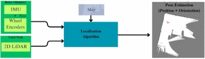
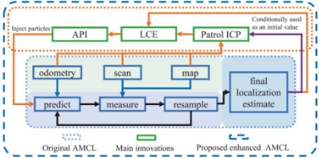
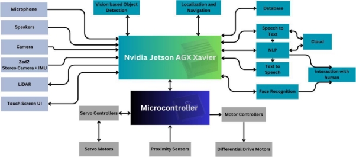
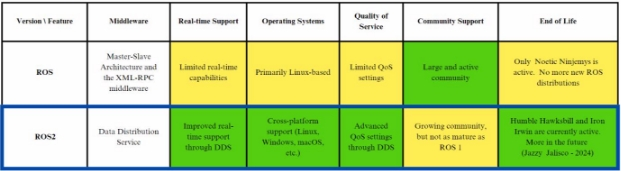
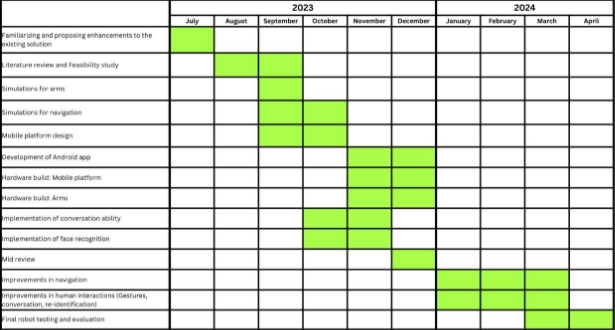

# SMART MOBILE ROBOT RECEPTIONIST 

***The project is still ongoing under different branches and hasn't been merged into the `main` branch.***

**Abstract** 

**Keywords: Robot receptionist, Robot assistant, Autonomous navigation, Hand gestures, NLP(Natural Language Processing), ROS2**  

A robot receptionist demonstrates superiority over a human receptionist by providing round-the-clock service, cost-effectiveness through reduced labor expenses, minimized errors, adaptability to multiple languages, efficient data management, and seamless integration with technology. These attributes make it an appealing choice for organizations aiming to enhance efficiency and customer service while optimizing operational costs. 

This feasibility report explores the potential for an indoor mobile robot receptionist project. It assesses the economic, social, and technical feasibility of developing and implementing such a system. The report highlights cost-effectiveness, service enhancement, and resource availability as key factors supporting  the  viability  of  this  innovative  solution  for  organizations  seeking  to  improve  their receptionist services. 

**1  Introduction** 

The indoor smart mobile receptionist project is mainly focused on making a robot that can replace a human who does a receptionist’s job. For the continuation of the project, it is essential to discuss the problem that we are going to solve, what is the proposed solution and how we are going to define the scope of the proposed solution. This chapter is mainly focused on those aspects. 

1. **Problem Statement** 

There are several challenges associated with employing human receptionists for an organization. Firstly, the repetitive nature of their work not only leads to decreased job satisfaction but also raises concerns about efficiency and the potential for errors. Moreover, the issue of receptionists falling asleep at their desks due to fatigue presents a significant image problem, affecting the professionalism of our services. Equally troubling is the situation during their breaks, leaving visitors and callers without assistance and leading to disruptions. Additionally, high labor costs associated with human receptionists strain our financial resources, limiting our ability to invest in other critical areas. The limited availability of human receptionists poses challenges in providing round-the-clock service and accommodating peak periods effectively. Lastly, the inevitable human errors in receptionist tasks have the potential to negatively impact  on  customer  satisfaction. Addressing  these issues is imperative  to  optimize  our  reception services and maintain the organization's reputation for excellence. 

2. **Main Objectives** 

To address the above problem, there is an already implemented receptionist robot at ENTC (Electronics and Telecommunication Engineering). That robot is a stationary robot with few hand gestures. It has human interactive capabilities to some extent. In our case, the following are the objectives we are trying to achieve.  

- Make the receptionist robot a mobile robot.  
- Enhance the modernized image of the receptionist   
- Implement an interactive system with enhanced conversational ability  capable of assisting people  
- Implement a system to detect and recognize humans with enhanced  re-identification features   
- Increase the number of hand gestures by increasing DoF  
- Configurability for different scenarios (Special events, Normal Days)  
- Develop an app to control the robot  *Figure 1.1 - Existing receptionist robot* 
3. **Project Scope** 
1. **Mobility** 

The scope of the robot's mobility is defined by several key constraints. Firstly, the robot is limited to operating on flat surfaces, primarily within the confines of the ENTC ground floor. This restriction ensures that the robot can navigate safely without encountering obstacles such as stairs, which are unsuitable for its design. Additionally, the robot's maximum speed is capped at 1.42 meters per second, a pace that aligns with the preferred walking speed of a human.  

2. **Navigation** 

The robot's navigation scope involves dealing with challenges in a constantly changing environment. It needs to accurately figure out its location and direction, especially in areas where things are always moving around. These areas may include flat surfaces with objects like carpets, which could get in the way. Moreover, the robot must plan its route thoughtfully to avoid running into things that stay put (like furniture) and things that might suddenly appear or move (like people or other objects). Achieving this navigation successfully requires using advanced techniques for sensing, creating maps, and deciding where to go safely while it goes about its receptionist tasks in a practical setting. 

3. **Human Interactions** 

The  robot's  scope  for  human  interactions  is  designed  to  facilitate  one-on-one  engagement  with individuals in a user-friendly and responsive manner. To initiate interaction, a simple trigger word like "Hello [ROBOT\_NAME]" can be used, making it easy for anyone to engage with the robot. The robot is  proficient  in  friendly  greetings  and  is  equipped  to  provide  straightforward  responses  to  basic inquiries. Additionally, it possesses the capability to guide users to specific locations, ensuring efficient assistance in a physical environment. For those who prefer touchscreen interaction, a user-friendly interface is available, allowing individuals to interact with the robot by touch. Importantly, the robot can recognize and remember users for personalized interactions. Operating in English, with a token size of 4096 and low latency of 50 milliseconds per token, it offers seamless and efficient communication with users, enhancing the overall receptionist experience. 

4. **Hand Gestures** 

The scope of the robot's hand gestures is designed to facilitate natural and  culturally respectful interactions with users. To begin, the robot greets with  the traditional Sri Lankan salutation "Ayubowan," demonstrating cultural  awareness and courtesy. Handshakes are another integral part of its non- verbal  communication  repertoire,  employing  four  degrees  of  freedom  (4  DoF) for each hand to mimic human-like handshakes, fostering a warm and  relatable  interaction.  Additionally,  the  robot  can  convey  directional  information through its hand gestures, making it effective in guiding users  within its environment. To enhance engagement, the robot incorporates a  single degree of freedom (1 DoF) for neck rotation, allowing it to turn its face  towards  the  speaker,  maintaining  eye  contact  for  more  engaging  

*Figure 1.2 - 4 DoF per arm* conversations. While the robot excels in expressive gestures and engagement, 

it refrains from tasks like lifting weights or picking and placing objects. Furthermore, it adheres to safety standards by limiting its maximum speed to 1 meter per second, as per ISO 10218-1:2011, ensuring secure and controlled movements during interactions. Overall, the robot's hand gestures encompass a wide range of expressions, ensuring a respectful, engaging, and culturally sensitive interaction with users.  

5. **Special Features** 

The robot boasts a set of special features designed to enhance its functionality and usability in various scenarios. Notably, it can provide stationery items, like pens for signing, through a clever pocket-like mechanism, ensuring that these small objects are readily accessible to users. Moreover, the robot can be easily controlled via an Android app, offering convenient and intuitive remote operation. Its full teleoperation capability allows users to guide it to predefined locations within its reachable area, enabling efficient and flexible navigation. A particularly handy feature is its ability to autonomously return to a designated home location when its battery level runs low, ensuring uninterrupted service, as it  can  automatically connect  to  the  charger. These  specialized  functionalities enhance  the  robot's versatility and user-friendliness, making it a valuable asset in various interactive settings. 

4. **Uniqueness of the Project** 

This  project  stands  out  as  a  trailblazing initiative, marking  the  debut  of  an indoor mobile robot receptionist  within  the  ENTC  (Electronics  and  Telecommunication  Engineering)  department.  Its uniqueness lies in its capacity to elevate human-robot interactions to a new level, armed with superior conversational skills and engaging interactive gestures. As the first of its kind, this robot offers a groundbreaking blend of technology and hospitality, transforming the receptionist role by providing a more personalized and immersive experience to visitors. By pioneering this innovative approach to reception services, this project not only showcases cutting-edge robotics but also sets a benchmark for future developments in the field, opening exciting possibilities for enhancing human-robot coexistence in indoor environments. 

5. **Potential Applications**  

The potential applications and beneficiaries of this project are both broad and impactful. The robot, with its receptionist and assistant capabilities, finds relevance in a wide spectrum of organizations and institutions that require efficient and interactive front-end services. From corporate offices and hotels to healthcare facilities and educational institutions, any organization with receptionist needs can benefit from  this  technology.  By  automating  routine  tasks  and  providing  assistance,  the  robot  enhances operational  efficiency  and  visitor  experiences.  This  inclusive  approach  makes  the  project  highly versatile, with the potential to revolutionize the way various entities interact with their clientele. Ultimately, the beneficiaries extend to anyone seeking  seamless and engaging reception services, making this innovative robot an asset with broad-reaching potential. 

6. **Navigation to the Chapters** 

The second chapter focuses on the literature review. Chapter three describes the methodology which has been decided by us to carry on the project. The third chapter also focuses on the risk factors, task delegation,  budget  estimations,  and  estimated  timeline  for  the  project.  Finally,  all  the  findings, feasibility studies, and impact of the project are discussed in the fourth chapter.  

**2  Literature Review** 

The literature review for the project is carried out to critically evaluate the existing implementation methods and select the suitable designs, software, and hardware components. This review is done under the topics of existing robots, robot locomotion, indoor robot localization, the conversational ability of the robot, human face detection and identification, and mobile app communication methods. 

1. **Existing Robots** 

The literature review on existing receptionist and assistant robots gives us an understanding of the key features required by such a robot. By studying the robots namely Nao, Pepper, Jupiter, and Alice,[1] we identified the key features required for our design. The main features that we identified are navigational ability, conversational ability, human identification ability, and conversational ability. The system is designed according to those findings.  

2. **Robot Locomotion** 

Locomotion of a humanoid robot can  be achieved by legged  or wheeled  configurations. Legged locomotion will add a lot of complexity to the project. Therefore, wheeled locomotion is selected. From wheeled configurations, two differential drive wheels are selected because of mechanical simplicity, cost-effectiveness,  and  control  simplicity.  Omnidirectional  locomotion,  namely  holonomic[2]  and mecanum wheels are omitted by considering mechanical complexity even if they are advantageous in the sense of achievable degrees of freedom. 

3. **Indoor Robot Localization** 

Robot localization is the process by which the robot determines its position and orientation within its environment. Several sensors and techniques can be used for localization[3], including wheel encoders, IMU(Inertial Measurement Unit) devices, GPS devices (Global Positioning System), UWB (Ultra- wideband) devices, LiDAR, cameras, and more. Considering cost and ease of implementation to obtain more accurate indoor pose estimation, a 2D LiDAR-based localization method has been selected for the project, as shown in the diagram below. LiDAR data serves as the sensor (observation model), while fused wheel encoder data and IMU data, which provide more accurate odometry, serve as the motion model for the algorithm. Additionally, a pre-built grid map of the environment is provided.[4]

*Figure 2.1 - Sensor fusion for localization* 

For robot localization, several algorithms are available, each with different pros and cons. Markov localization and grid localization have low time and memory efficiency. EKF[6] (Extended Kalman Filter)  localization  has  high  memory  and  time  efficiency,  but  it  assumes  the  sensors  and  other information as Gaussian models. Additionally, under an unknown initial pose, EKF localization fails to determine the pose correctly. Monte Carlo Localization offers more benefits than others. It has better memory and time efficiency than Grid and Markov localizations, greater robustness than EKF, and it works even under an unknown initial pose. 

` `Adaptive  Monte  Carlo  Localization  (AMCL)[5]  is  a  popular  implementation  of  Monte  Carlo Localization in ROS (Robot Operating System).  

An enhanced version of AMCL, which was recently developed by several researchers, is used for the project. It performs better even in dynamic and featureless environments.  

*Figure 2.2 - Enhanced AMCL* 

4. **Conversational Ability of the Robot** 

The conversation ability of the robot is archived by a hybrid approach[8] of using the RASA framework[7] and  chatGPT-3.5  turbo API[10].  RASA  framework  can  be  used  to  create  conversational  chatbots. Greetings, basic conversations and information about the organization will be handled by the local RASA chat model with lower latency. Other more generalized and complex conversations will be handled by the chatGPT-3.5 turbo API service. Compared to other options like ruled-based chat models and open-source Large Language Models[9] ; both the RASA framework and chatGPT-3.5 turbo API are based on deep learning architectures; language understanding and generating capabilities are at a higher level. By considering the training complexity, training cost, and maintenance cost, this hybrid method is selected.  

5. **Human Face Identification and Recognition** 

For the human face detection system, there are several models we can use. VGG-Face, Google FaceNet, OpenFace, Facebook DeepFace, DeepID, Dlib, and ArcFace[11] are the implementations that we can use. From that, we have considered the accuracy and the latest implementation and selected ArcFace for our project. According to the paper published for ArcFace, it has an accuracy of 99.83% for the LWF(Labeled Faces in the Wild) dataset and ArcFace was released in 2018. 

6. **Mobile App Communication Method**  

The pros and cons of some real-time communication methods were considered. Local network socket doesn’t need internet, but the user must be in the same network then the user experience will be poor. WebSocket  needs  to  have  an  external  server.  While  MQTT  tunneling  needs  to  have  separate authentication handling. Using a combination of Firebase services[12] is a good solution for that. The free quota will be sufficient for our requirements. The only drawback is no readymade ROS nodes available. ROS nodes should be developed from scratch[13].

7. **Summary** 

In this section, the possible methods to implement technological aspects of the robot are critically compared. From the comparisons, the best method for each aspect has been selected to continue the project. 

**3  Methodology** 

This chapter describes how we are going to implement our system considering the resources we have and resources that can be acquired by us in the future. Decisions are made considering the possible risks under technical, sustainable, and financial aspects. 

1. **Proposed Robot Architecture** 

*Figure 3.1 - Robot Architecture* 

2. **Analysis of Alternative Strategies** 
1. **Controlling Board** 

The controlling board for the project is selected mainly considering the computational power and ability to handle multiple tasks at one time. For this, we considered the controlling boards which are already available for us from the university funding. From the Raspberry Pi 3b+ board and Nvidia Jetson AGX Xavier boards, we selected the second option to continue our project. 

2. **ROS Version** 

The proposed robot system will be implemented using ROS2 (Robot Operating System 2). The selection was done according to the following criteria.[14]

*Table 3.1 - Selecting ROS version* 

3. **Dynamic Obstacles Detection** 

For dynamic obstacle detection, two options are available, ZED2 stereo camera and 2D LiDAR. LiDAR offers a 360-degree field of view, whereas the ZED2 offers 120 degrees. Financially, the cost of LiDAR is lower than that of the ZED2. However, the availability of object tracking and IMU data, which are not provided by LiDAR, are the main advantages of the ZED2. Therefore, ZED2 has been selected as the dynamic obstacle detection method. 

3. **Risks and Solutions** 
1. **Technical** 

Safety and emergency handling is a possible risk. As solutions, implement safety features such as emergency stop buttons and obstacle detection systems, to halt the robot in emergencies. As a solution to the battery life and charging issue, optimize the robot’s energy efficiency through software and hardware design. Implementing robust data encryption and security measures is the solution for privacy risks.   

2. **Sustainable** 

For the risk of components not arriving on time and deprecated components, ordering components in advance, and buying extra components for backup will be a solution. Use cooling fans to prevent overheating controller boards.  

3. **Financial** 

To survive from USD rate increments, get all necessary components as soon as possible. Consider alternative materials as a solution for fluctuations in material costs. 

4. **Task Delegation** 

|Chamod |
- Gestures 

- Touch panel GUI and Mobile app 
|
| - | - |
|Sasinindu |
- Natural language processing 

- Face identification and recognition system 
|
|Vidura |
- Mobile platform design and low-level driving system 

- Face identification and recognition system 
|
|Chathushka |
- Robot navigation 

- Robot perception using vision 
|

*Table 3.2 - Task Delegation* 

5. **Budget Estimation** 

|Component |Price (USD) |Price (LKR) (rates as of 10/09/23)  |Funding |
| - | - | - | - |
|Jetson AGX Xavier |1,399 |451459\.82 |University |
|Lidar |228 |92842\.27 |University |
|Kinect camera |449 |144893\.11 |University |
|Dummy |50 |16247\.58 |University |
|Mic Array |100 |32495\.16 |Self |
|Motors |600 |193421\.40 |Self |
|Circuits |150 |48355\.35 |Self |
|Battery + Charger |70 |22565\.83 |Self |
|Total |~3050 |~1,000,000 |University + Self |

*Table 3.2 - Budget calculation* 

6. **Timeline** 

7. **Initial Results** 

Achieved desired hand gestures with 4 DoF in Webots simulator. 

 

 

 

 

*Figure 3.2 - Simulating desired gestures in Webots* 

8. **Summary** 

From the methodology, we describe how we are going to implement our robot system. After that, the possible risk factors and proposed solutions are discussed. From that discussion, we get a better idea of what are the possible risks we can encounter during the project. Then the budget estimation gives us a clear idea of how the expenses are going to happen. Then our initial project timeline is decided by considering all the sub-tasks and the mid-review. Then some of the initial results are also presented. 

**4  Discussion and Conclusion** 

After the literature review and the proposed methodology, this chapter revises the highlights of the previous chapters. An analysis of technical, financial, and social feasibilities is also carried out. Then the conclusion of the project feasibility study is stated at the end. 

1. **Main Findings of the Literature Review** 

The literature review was carried out to find the best possible implementation of each technical aspect of the robot. 

1. Robot Locomotion - Wheeled Locomotion 
1. Indoor Robot Localization - Adaptive Monte Carlo Localization  
1. Conversational Ability of the Robot - RASA framework &ChatGPT-3.5 turbo API 
1. Human Face Identification and Recognition - ArcFace Model 
1. Mobile App Communication Method - A combination of Firebase services 
2. **Feasibility** 
1. **Technical Feasibility** 

The technical feasibility of our receptionist robot project is firmly established, as we have all the essential components required for its development. Our team possesses the necessary hardware and software expertise, ensuring that we can construct the robot efficiently. Additionally, our access to vital software and external services required for specific technical aspects of the project guarantees a smooth implementation process. With these resources in place, we are well-equipped to overcome technical challenges,  ensuring  the  successful  creation  and  deployment  of  our  receptionist  robot  with  the confidence that it can meet the technological demands of today's world. 

2. **Financial Feasibility** 

One of the main goals of this project is to implement a receptionist robot with optimum cost. 

The most significant costs of the project are, 

1. Jetson AGX Xavier - $ 1,399 
1. Lidar - $ 228 
1. Kinect - $ 449 
1. Motors - $ 600 

From the estimated budget calculations, the overall budget is nearly USD 3050 Since most of the expensive  components  are  provided  by  the  department,  we  remain  positive  about  the  financial feasibility of the project. 

3. **Social Feasibility** 

A robot receptionist can greatly improve an organization's image by addressing the issues of inefficient human receptionists. These human receptionists may sometimes provide subpar service, leading to negative perceptions. A robot receptionist can replace them, saving labor costs and offering reliable 24/7 assistance. Additionally, it presents organizations as modern and customer-focused, enhancing their image in the eyes of customers and society. In summary, a receptionist robot's social feasibility lies in its ability to enhance efficiency and bolster an organization's positive image. 

3. **Impact of the Project** 
1. **Local Impact** 

The introduction of a robot receptionist in Sri Lanka is a new and exciting development. This technology has the potential to replace human receptionists, leading to cost savings for businesses by reducing labor expenses. Additionally, it can offer improved customer service, as it's available round the clock and ensures consistent assistance. Moreover, having a robot receptionist can give organizations a fresh and modern image, showing their willingness to embrace new technology. In a local context, this innovation can  positively  impact  Sri  Lankan  businesses  by  streamlining  operations  and  enhancing  customer experiences, ultimately contributing to their competitiveness and growth. 

2. **Global Impact** 

Our cost-effective and customizable receptionist robot has the potential for a significant global impact. Many  existing  receptionist  robots  are  prohibitively  expensive,  limiting  their  accessibility.  Our innovation changes this by making this technology affordable for businesses of all sizes worldwide. Additionally, its adaptability to suit the unique needs of any organization enhances its applicability and potential benefits on a global scale, fostering increased efficiency and customer satisfaction across industries. In summary, our robot democratizes this transformative technology, making it accessible and beneficial to organizations worldwide. 

4. **Conclusions** 

This project involves a lot of hardware implementation. Therefore, the expenditure for the project will be a higher amount and some of that must be handled by our funding. Other than that, this project will result in a unique solution for the stated problem in Chapter One. There will be a lot of challenges during the project and from the possible risk analysis, we try to predict everything possible to overcome those challenges. This project will add a lot of value to the industry of robot receptionists or robot assistants, and it will have a major impact in the sense of locally and globally. 

**References** 

1. “Reception robot - All industrial manufacturers.” [Online]. Available: https://www.directindustry.com/industrial-manufacturer/reception-robot-229115.html 
1. Moreno, J., et al. "Design, implementation and validation of the three-wheel holonomic motion system of the assistant personal robot (APR)," in Sensors, vol. 16, no. 10, pp. 1658, 2016. 
1. R. Vincent, B. Limketkai, M. Eriksen, "Comparison of indoor robot localization techniques in the absence of GPS," in Detection and sensing of mines, explosive objects, and obscured targets XV, 2010, pp. 606–610. 
1. S. Thrun, W. Burgard, and D. Fox, *Probabilistic robotics*. Cambridge, Mass.: Mit Press, 2010. 
1. He, Shan, et al. "An Enhanced Adaptive Monte Carlo Localization for Service Robots in Dynamic and Featureless Environments." Journal of Intelligent & Robotic Systems 108.1 (2023): 1-17 
1. Hu, Bingshan, et al. "Global vision localization of indoor service robot based on improved iterative extended kalman particle filter algorithm." Journal of Sensors 2021 (2021): 1-11. 
1. Sharma, Rakesh Kumar, and Manoj Joshi. "An analytical study and review of open source chatbot framework, rasa." Int. J. Eng. Res 9.06 (2020): 1011-1014. 
1. McTear, Michael, Sheen Varghese Marokkie, and Yaxin Bi. "A Comparative Study of Chatbot Response Generation: Traditional Approaches Versus Large Language Models." International Conference on Knowledge Science, Engineering and Management. Cham: Springer Nature Switzerland, 2023. 
1. Touvron, Hugo, et al. "Llama 2: Open foundation and fine-tuned chat models." arXiv preprint arXiv:2307.09288 (2023). 
1. OpenAI, “Pricing,” openai.com. Available:[ https://openai.com/pricing ](https://openai.com/pricing)
1. Deng, Jiankang, et al. "Arcface: Additive angular margin loss for deep face recognition." Proceedings of the IEEE/CVF conference on computer vision and pattern recognition. 2019. 
1. “Using Firebase Realtime Database to Control Robots Remotely over the Internet ROS Developers Day2022,” www.youtube.com. https://www.youtube.com/watch?v=bQgAIV3eHbg (accessed Oct. 01, 2023). 
1. M. Melo, “ROS\_2\_ANDROID,” GitHub, Sep. 21, 2023. https://github.com/mirellameelo/ROS\_2\_ANDROID (accessed Oct. 01, 2023). 
1. Quigley, Morgan, et al. "ROS: an open-source Robot Operating System." ICRA workshop on open source software. Vol. 3. No. 3.2. 2009. 
11 
